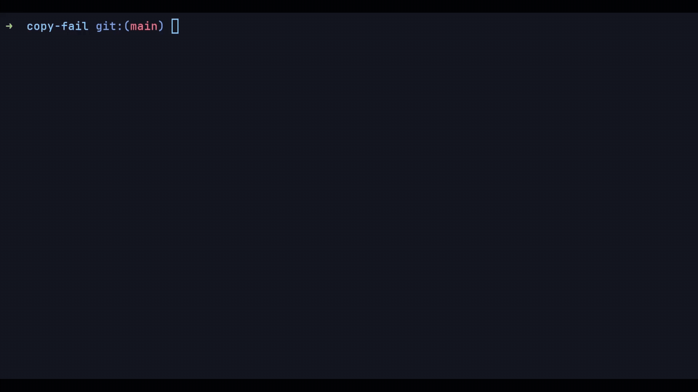

# Copy Fail PoC

## English

Python PoC for **CVE-2026-31431**, intended for controlled laboratory testing on authorized Linux systems.

> For use only in your own environments, labs, or systems where you have explicit permission. Do not run this code against third-party systems.

### Description

`copy-fail.py` checks whether `algif_aead` is available through the kernel `AF_ALG` interface and, if the system is compatible with the technique tested by this PoC, attempts to modify the page cache of a target SUID binary to launch an interactive PTY shell.

The script includes payloads for:

- `x86_64`
- `i686`
- `aarch64`



### Requirements

- Linux.
- Python 3.10 or newer.
- Local access to the test system.
- Kernel support for `AF_ALG` and `algif_aead`.
- A readable target SUID binary. The default target is `/usr/bin/su`.

No external Python dependencies are required; the script only uses standard library modules.

### Usage

Show help:

```bash
python3 copy-fail.py --help
```

Run with the default target (`/usr/bin/su`):

```bash
python3 copy-fail.py
```

Use another SUID binary as the target:

```bash
python3 copy-fail.py --target /usr/bin/newgrp
```

Run a specific command as root:

```bash
python3 copy-fail.py --exec /bin/bash
```

Disable automatic terminal setup:

```bash
python3 copy-fail.py --no-setup
```

Show the project version:

```bash
python3 copy-fail.py --version
```

### Options

| Option | Description |
| --- | --- |
| `-t`, `--target PATH` | Target SUID binary. Default: `/usr/bin/su`. |
| `-e`, `--exec CMD` | Command to run as root. Must be provided as a full path. |
| `--no-setup` | Disables automatic terminal environment setup. |
| `--version` | Shows the project version. |
| `-h`, `--help` | Shows the program help. |

### Runtime Checks

Before running the main flow, the script attempts to create and bind an `AF_ALG` socket with:

```text
authencesn(hmac(sha256),cbc(aes))
```

If `algif_aead` is not available, the program exits without continuing.

### Safe Tests

The test suite only covers inert CLI paths such as `--help` and `--version`. It does not execute the PoC flow.

```bash
python3 -m unittest discover -s tests
```

### Tested On

- Ubuntu 24.04
- RHEL 14.3
- SUSE Linux Enterprise 16
- Debian 13

### Security Notes

- Run it only on disposable machines or lab environments.
- Behavior depends on the kernel, architecture, and available SUID binaries.
- The PoC manipulates system page cache memory during the test; avoid running it on production machines.
- Review and understand the code before executing it.

### Project Files

- `copy-fail.py`: complete PoC implementation and CLI.
- `tests/test_cli.py`: safe CLI smoke tests.
- `SECURITY.md`: security policy and reporting scope.
- `DISCLAIMER.md`: authorized-use disclaimer.
- `CHANGELOG.md`: release history.
- `CONTRIBUTING.md`: contribution guidelines.
- `LICENSE`: license status placeholder.

### License

No formal license has been selected yet. Until the copyright holder adds one, all rights are reserved.

## Espanol

PoC en Python para **CVE-2026-31431**, orientado a pruebas controladas de laboratorio en sistemas Linux autorizados.

> Uso exclusivo en entornos propios, de laboratorio o con permiso explicito. No ejecutes este codigo contra sistemas de terceros.

### Descripcion

`copy-fail.py` verifica la disponibilidad de `algif_aead` mediante la interfaz `AF_ALG` del kernel y, si el sistema es compatible con la tecnica probada por el PoC, intenta modificar la page cache de un binario SUID objetivo para lanzar una shell con PTY interactiva.

El script incluye payloads para:

- `x86_64`
- `i686`
- `aarch64`


### Requisitos

- Linux.
- Python 3.10 o superior.
- Acceso local al sistema de pruebas.
- Soporte de kernel para `AF_ALG` y `algif_aead`.
- Un binario SUID objetivo legible. Por defecto usa `/usr/bin/su`.

No requiere dependencias externas de Python; usa modulos de la biblioteca estandar.

### Uso

Mostrar ayuda:

```bash
python3 copy-fail.py --help
```

Ejecutar con el objetivo por defecto (`/usr/bin/su`):

```bash
python3 copy-fail.py
```

Usar otro binario SUID como objetivo:

```bash
python3 copy-fail.py --target /usr/bin/newgrp
```

Ejecutar un comando especifico como root:

```bash
python3 copy-fail.py --exec /bin/bash
```

Deshabilitar la configuracion automatica de terminal:

```bash
python3 copy-fail.py --no-setup
```

Mostrar la version del proyecto:

```bash
python3 copy-fail.py --version
```

### Opciones

| Opcion | Descripcion |
| --- | --- |
| `-t`, `--target PATH` | Binario SUID objetivo. Default: `/usr/bin/su`. |
| `-e`, `--exec CMD` | Comando a ejecutar como root. Debe indicarse con ruta completa. |
| `--no-setup` | Deshabilita la configuracion automatica del entorno de terminal. |
| `--version` | Muestra la version del proyecto. |
| `-h`, `--help` | Muestra la ayuda del programa. |

### Comprobaciones que realiza

Antes de ejecutar el flujo principal, el script intenta crear y enlazar un socket `AF_ALG` con:

```text
authencesn(hmac(sha256),cbc(aes))
```

Si `algif_aead` no esta disponible, el programa termina sin continuar.

### Pruebas seguras

La suite de pruebas solo cubre rutas inertes de CLI como `--help` y `--version`. No ejecuta el flujo del PoC.

```bash
python3 -m unittest discover -s tests
```

### Probado en

- Ubuntu 24.04
- RHEL 14.3
- SUSE Linux Enterprise 16
- Debian 13

### Notas de seguridad

- Ejecutalo solo en maquinas desechables o entornos de laboratorio.
- El comportamiento depende del kernel, la arquitectura y los binarios SUID disponibles.
- El PoC manipula memoria de cache del sistema durante la prueba; evita usarlo en equipos de produccion.
- Revisa y entiende el codigo antes de ejecutarlo.

### Archivos del proyecto

- `copy-fail.py`: implementacion completa del PoC y CLI.
- `tests/test_cli.py`: pruebas seguras de la CLI.
- `SECURITY.md`: politica de seguridad y alcance de reportes.
- `DISCLAIMER.md`: aviso de uso autorizado.
- `CHANGELOG.md`: historial de cambios.
- `CONTRIBUTING.md`: guia de contribucion.
- `LICENSE`: estado actual de licencia.

### Licencia

Todavia no se ha seleccionado una licencia formal. Hasta que el titular de derechos agregue una, todos los derechos quedan reservados.
